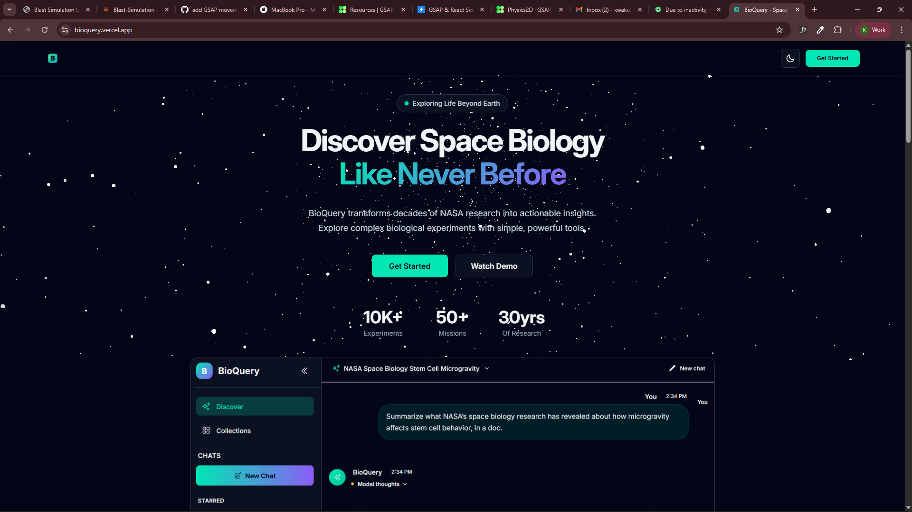
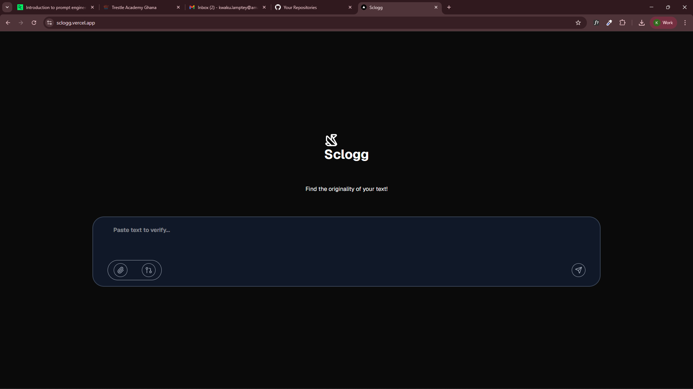
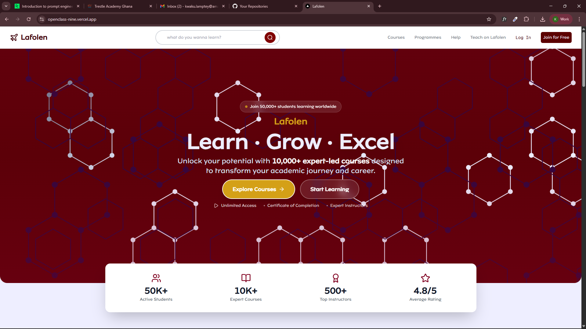

<!-- Profile Header -->

  

<h1 align="center">This is <strong>Jake Abednego Lamptey</strong> </h1>

  <strong>Software Engineer • Web & Mobile • AI • Problem Solver</strong>

  I build modern, high-performance applications with beautiful interfaces and deep technical thinking.  
  Passionate about AI tools, clean architecture, performant user experiences, and solving real problems.

---

##  About Me

-  Ghana-based Software Engineer  
-  I build **building AI-powered tools quietly**, **full-stack apps**, and **beautiful UIs**  
-  Recently worked on:
  - BioQuery – a NASA-style scientific search engine  
  - Sclogg – AI text originality detection  
  - OpenClass – an online classroom collaboration platform  
  - Energy dashboard & green-tech UI  
-  Bonus:  
-  Improving my skills in web animations using GSAP
-  Taking AI Engineering certifications
-  Learning 3D game development 
-  Tech Stack:  
  **Next.js • React • TypeScript • Node.js • Firebase • Sanity • Tailwind • Expo • GSAP • Microservices**

---

##  Featured Project – BioQuery  

  

**BioQuery** transforms decades of NASA biological research into actionable insights.  
Built with **Next.js, TailwindCSS, AI Models, and vector databases**.

**Highlights:**
- Interactive galaxy-themed UI  
- Scientific chat AI  
- Collections, experiments, and dataset browsing  
- Real-time insights and summarization

🔗 **Live Demo:** https://bioquery.vercel.app  
🔗 **Repo:** *( private)*

---

##  Sclogg – AI Content Detector

  

Sclogg helps users verify the originality of written text using AI-powered detector models.

**Features**
- Paste text to verify  
- Lightweight UI  
- Fast inference  
- Built with **Next.js + AI Embeddings**

🔗 **Live Demo:** https://sclogg.vercel.app  

---

##  OpenClass – Online Classroom

A modern, elegant platform for hosting classes online with real-time chat, whiteboard, and assignment sharing.

  

---

##  Discord Clone

A visually rich UI clone built with **React & Tailwind**, mimicking Discord’s layout + interactivity.

> *(screenshot not ready)*

---

##  Green Energy Dashboard

A clean UI dashboard built around renewable energy, power usage analytics, charts, and forecasting.

> *(screenshot not ready)*

---

#  Tech Stack

  

---

#  GitHub Stats

  
  

  

---

#  Activity Graph

  

---

# Thanks for visiting !

  

# If you like any of my work, feel free to star the repositories; it means a lot!

#  Contact Me

  <a href="mailto:qweikujake@gmail.com"><strong>Email</strong></a> • 
  <a href="https://www.linkedin.com/in/jalamp"><strong>LinkedIn</strong></a> • 
  <a href="https://github.com/Jake-Ab"><strong>GitHub</strong></a>

---

  <strong>“Build boldly. Ship fast. Solve real problems.”</strong>

